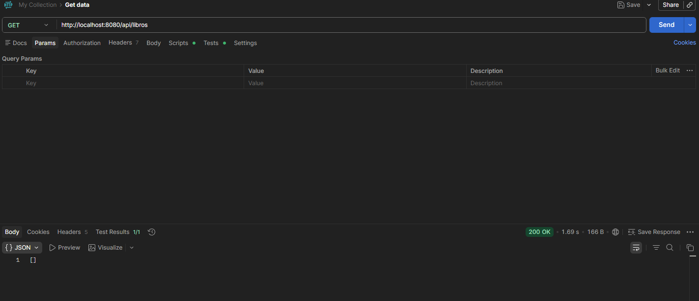
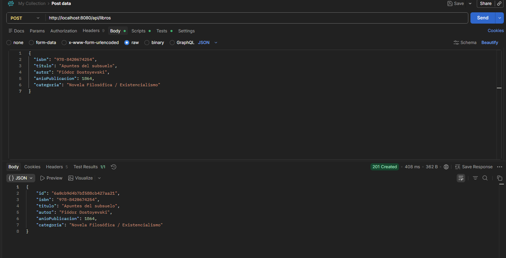
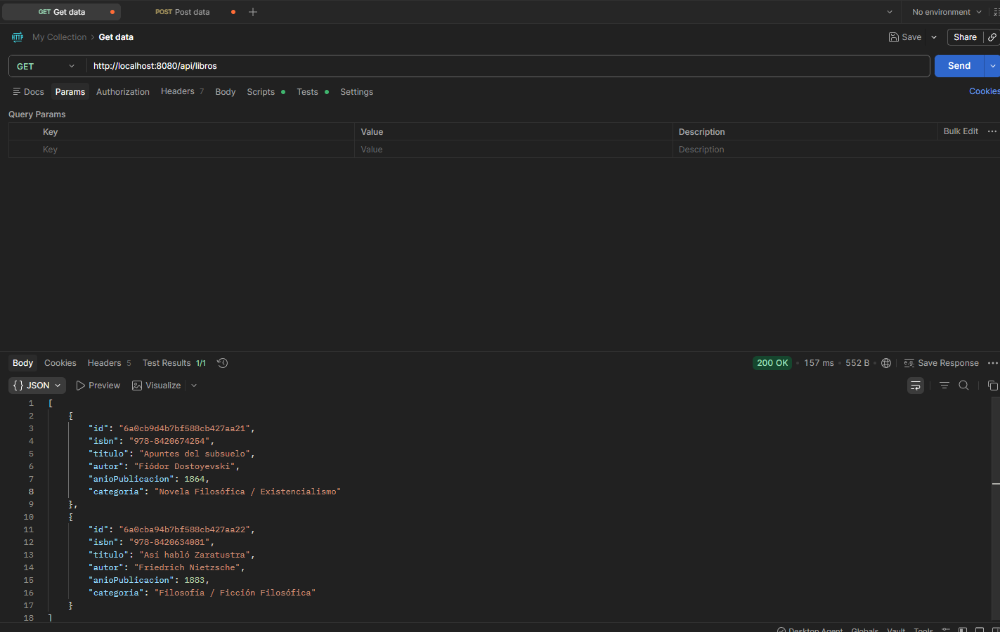
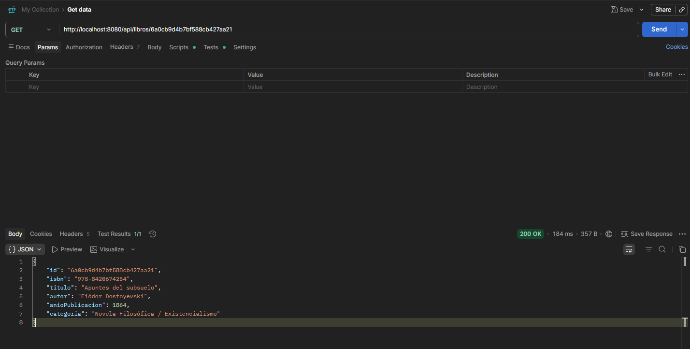
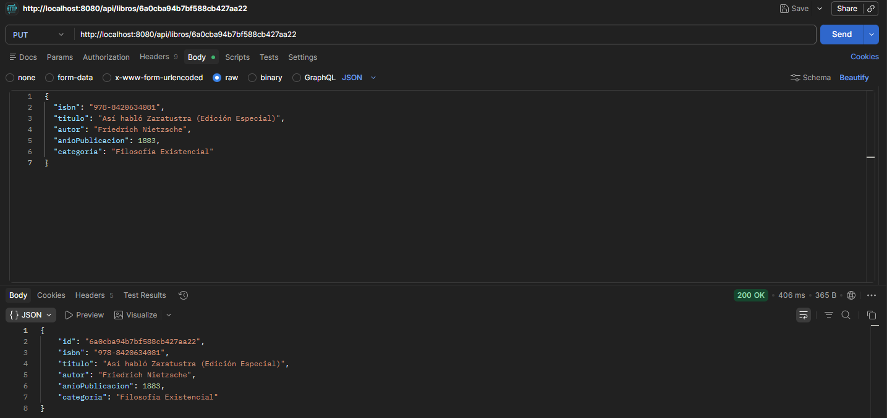
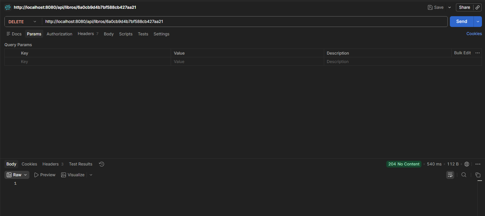
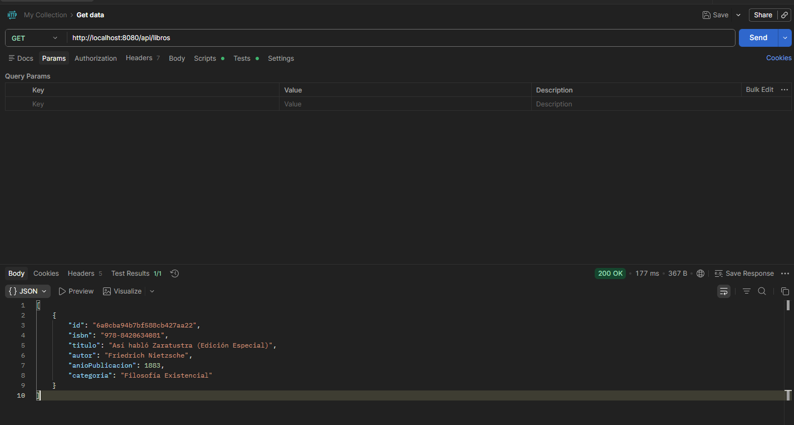

# API REST - Sistema de Biblioteca

API REST para gestionar libros, desarrollada con Spring Boot y MongoDB Atlas siguiendo una arquitectura por capas (Model, Repository, Service, DTO y Controller).

## Endpoints

| Método | URL | Descripción |
|--------|-----|-------------|
| POST | `/api/libros` | Crear libro |
| GET | `/api/libros` | Listar todos los libros |
| GET | `/api/libros/{id}` | Consultar libro por ID |
| PUT | `/api/libros/{id}` | Actualizar libro por ID |
| DELETE | `/api/libros/{id}` | Eliminar libro por ID |

**Base URL:** `http://localhost:8080`


## Pruebas en Postman

**Requisitos:** API en ejecución en entorno local y MongoDB Atlas conectado. 

A continuación, se detalla el ciclo de pruebas completo en el orden cronológico exacto en el que fue ejecutado para validar el comportamiento del CRUD y la persistencia en la base de datos:

### 1. Consulta Inicial — `GET /api/libros` (Base de Datos Vacía)
Se realiza la primera petición de lectura al servidor. Al no haber registros creados en el clúster de MongoDB, el backend retorna exitosamente un estado **200 OK** junto con un arreglo JSON vacío `[]`.



---

### 2. Creación de Registro — `POST /api/libros`
Se envía en el cuerpo de la petición (*Body*) el JSON con los datos de la obra de Fiódor Dostoyevski. El servidor procesa la petición de manera correcta, almacena el registro de forma persistente en la nube y devuelve un estado **201 Created** junto con el objeto que ahora incluye el campo `"id"` autogenerado por MongoDB (`6a0cb9d4b7bf588cb427aa21`).



---

### 3. Listado General — `GET /api/libros` (Persistencia de Dos Libros)
Tras haber enviado también un segundo registro (*Así habló Zaratustra* de Friedrich Nietzsche), se consulta nuevamente la lista completa. El servidor responde con un estado **200 OK** devolviendo una colección con los dos documentos almacenados en Atlas, demostrando que la persistencia funciona de forma ideal.



---

### 4. Consulta Específica — `GET /api/libros/{id}`
Se toma el identificador único de *Apuntes del subsuelo* y se anexa al final de la URL como un parámetro de ruta. La API intercepta el ID, realiza la búsqueda exacta en la base de datos y extrae únicamente la información de dicho libro con un código de estado **200 OK**.



---

### 5. Actualización — `PUT /api/libros/{id}`
Para corregir o complementar los datos de un registro, se apunta a la ruta específica de la obra de Nietzsche (`6a0cba94b7bf588cb427aa22`) y se envía un nuevo JSON modificado. El backend actualiza los campos correspondientes en la base de datos y retorna el documento ya modificado con el estado **200 OK**.



---

### 6. Eliminación de Registro — `DELETE /api/libros/{id}`
Se ejecuta el método de borrado apuntando directamente al ID de *Apuntes del subsuelo*. La base de datos destruye el documento en la nube y el servidor backend responde con un código de estado estándar **204 No Content**, indicando que la acción se completó con éxito y no hay contenido para retornar.



---

### 7. Verificación Final — `GET /api/libros`
Como último paso de control, se consulta la lista global de libros por tercera vez. El servidor retorna un estado **200 OK** conteniendo únicamente la edición actualizada de *Así habló Zaratustra*. Se confirma así de manera irrefutable que el registro de Dostoyevski fue borrado correctamente de MongoDB Atlas.



---

## Estructura de Datos (JSON de Ejemplo)

Para las operaciones de inserción y modificación de datos, se maneja el header `Content-Type: application/json` con la siguiente estructura de ejemplo:

```json
{
  "isbn": "978-8420674254",
  "titulo": "Apuntes del subsuelo",
  "autor": "Fiódor Dostoyevski",
  "anioPublicacion": 1864,
  "categoria": "Novela Filosófica / Existencialismo"
}
